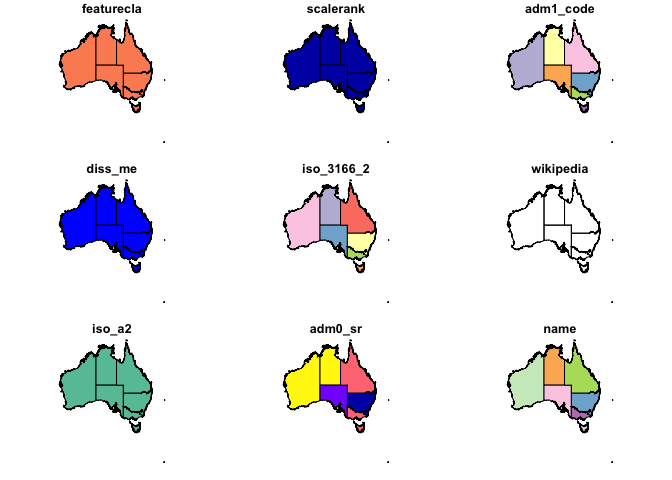
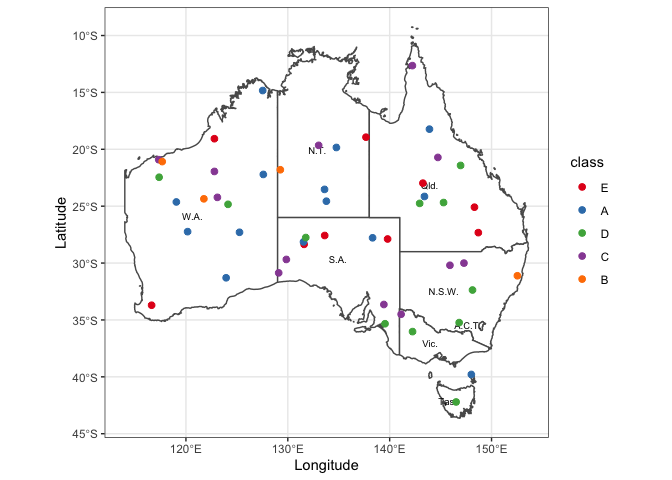

``` r
knitr::opts_chunk$set(
  fig.path = "figures/README_files"
)
```

## Creating a Map of Australia, Adding Data for Sample Collection Points

This is a simple RMD file to illustrate how to use
[*rnaturalearth*](https://github.com/ropenscilabs/rnaturalearth),
[*simple
features*](https://cran.r-project.org/web/packages/sf/vignettes/sf1.html)
and *ggplot2* to create a map of Australia and plot data collection
points on it.

### Setup

To do this you’ll need a few packages from CRAN:

``` r
if (!require("pacman")) {
  install.packages("pacman")
}
```

    ## Loading required package: pacman

``` r
library("pacman")
p_load(tidyverse, rnaturalearth, rnaturalearthdata, raster, sf, rgeos, lwgeom)
if (!require("rnaturalearthhires")) {
  p_install_gh("ropenscilabs/rnaturalearthhires")
}
```

    ## Loading required package: rnaturalearthhires

### Add a Shapefile of Australia

This is our base layer, Australia, of the map from
(Naturalearth.com)\[<https://naturalearth.com/>\].

``` r
oz_sf <- rnaturalearth::ne_states(geounit = "australia",
                                  returnclass = "sf")

plot(oz_sf)
```

    ## Warning: plotting the first 9 out of 83 attributes; use max.plot = 83 to plot
    ## all

<!-- -->

However, it includes several islands and ocean that are not of interest
to us. To fix this, crop it down to just the mainland plus Tasmania and
remove Jervis Bay so that the labels on the final map product are
cleaner.

``` r
oz_sf <- st_intersection(oz_sf,
                         st_set_crs(st_as_sf(as(
                           raster::extent(114,
                                          155,
                                          -45,
                                          -9),
                           "SpatialPolygons"
                         )),
                         st_crs(oz_sf)))
```

    ## although coordinates are longitude/latitude, st_intersection assumes that they are planar

    ## Warning: attribute variables are assumed to be spatially constant throughout all
    ## geometries

``` r
oz_sf <- oz_sf[oz_sf$abbrev != "J.B.T.",]

plot(oz_sf)
```

    ## Warning: plotting the first 9 out of 83 attributes; use max.plot = 83 to plot
    ## all

<!-- -->

## Import Collection Point Data

If you have your own data in a .csv file, import it using `read_csv()`.
These are just random points that I generated and saved as a .csv file
for this work to illustrate how to add points to a map.

``` r
point_data <- read_csv("sample_points.csv",
                       col_types = cols(
                         col_double(),
                         col_double(),
                         col_factor()
                       ))
```

## Plot Using ggplot2

Plot the final combination of data with the Naturalearthdata Australia
data and state outlines with the sampling location points overplayed and
colour-coded by the state where they were sampled.

``` r
oz <- ggplot(oz_sf) +
  geom_sf(fill = "white") +
  geom_text(
    data = oz_sf,
    aes(x = longitude,
        y = latitude,
        label = abbrev),
    size = 2.5,
    hjust = 1
  ) +
  geom_point(data = point_data,
             aes(x = Longitude,
                 y = Latitude,
                 colour = class),
             size = 2) +
  theme_bw() +
  scale_colour_brewer(type = "Qualitative", palette = "Set1") +
  xlab("Longitude") +
  ylab("Latitude") +
  coord_sf()

oz
```

<!-- -->

## Save the Graph

Export at 500 DPI for publication with a width 190mm for a 2-column
width figure.

``` r
ggsave("Australia_Map.tiff",
       width = 190,
       units = "mm",
       dpi = 500)
```

## Meta

### Code of Conduct

Please note that the R\_map\_with\_points\_Oz project is released with a
[Contributor Code of
Conduct](https://contributor-covenant.org/version/2/0/CODE_OF_CONDUCT.html).
By contributing to this project, you agree to abide by its terms.

### R Session Information

    ## R version 4.0.2 (2020-06-22)
    ## Platform: x86_64-apple-darwin17.0 (64-bit)
    ## Running under: macOS Catalina 10.15.5
    ## 
    ## Matrix products: default
    ## BLAS:   /Library/Frameworks/R.framework/Versions/4.0/Resources/lib/libRblas.dylib
    ## LAPACK: /Library/Frameworks/R.framework/Versions/4.0/Resources/lib/libRlapack.dylib
    ## 
    ## locale:
    ## [1] en_AU.UTF-8/en_AU.UTF-8/en_AU.UTF-8/C/en_AU.UTF-8/en_AU.UTF-8
    ## 
    ## attached base packages:
    ## [1] stats     graphics  grDevices utils     datasets  methods   base     
    ## 
    ## other attached packages:
    ##  [1] rnaturalearthhires_0.2.0 lwgeom_0.2-5             rgeos_0.5-3             
    ##  [4] sf_0.9-4                 raster_3.3-7             sp_1.4-2                
    ##  [7] rnaturalearthdata_0.1.0  rnaturalearth_0.1.0      forcats_0.5.0           
    ## [10] stringr_1.4.0            dplyr_1.0.0              purrr_0.3.4             
    ## [13] readr_1.3.1              tidyr_1.1.0              tibble_3.0.1            
    ## [16] ggplot2_3.3.2            tidyverse_1.3.0          pacman_0.5.1            
    ## 
    ## loaded via a namespace (and not attached):
    ##  [1] Rcpp_1.0.4.6       lubridate_1.7.9    lattice_0.20-41    class_7.3-17      
    ##  [5] clisymbols_1.2.0   assertthat_0.2.1   digest_0.6.25      prompt_1.0.0      
    ##  [9] R6_2.4.1           cellranger_1.1.0   backports_1.1.8    reprex_0.3.0      
    ## [13] evaluate_0.14      e1071_1.7-3        httr_1.4.1         pillar_1.4.4      
    ## [17] rlang_0.4.6        readxl_1.3.1       rstudioapi_0.11    blob_1.2.1        
    ## [21] rmarkdown_2.3      munsell_0.5.0      broom_0.5.6        compiler_4.0.2    
    ## [25] modelr_0.1.8       xfun_0.15          pkgconfig_2.0.3    htmltools_0.5.0   
    ## [29] tidyselect_1.1.0   codetools_0.2-16   fansi_0.4.1        crayon_1.3.4.9000 
    ## [33] dbplyr_1.4.4       withr_2.2.0        grid_4.0.2         nlme_3.1-148      
    ## [37] jsonlite_1.7.0     gtable_0.3.0       lifecycle_0.2.0    DBI_1.1.0         
    ## [41] magrittr_1.5       units_0.6-7        scales_1.1.1       KernSmooth_2.23-17
    ## [45] cli_2.0.2          stringi_1.4.6      farver_2.0.3       fs_1.4.1          
    ## [49] xml2_1.3.2         ellipsis_0.3.1     generics_0.0.2     vctrs_0.3.1       
    ## [53] RColorBrewer_1.1-2 tools_4.0.2        glue_1.4.1         hms_0.5.3         
    ## [57] parallel_4.0.2     yaml_2.2.1         colorspace_1.4-1   classInt_0.4-3    
    ## [61] rvest_0.3.5        knitr_1.29         haven_2.3.1
