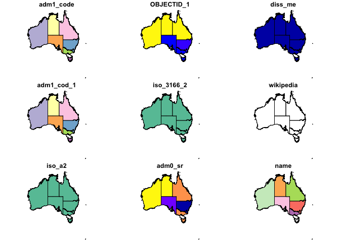
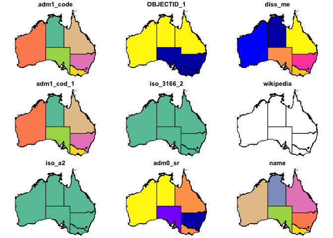
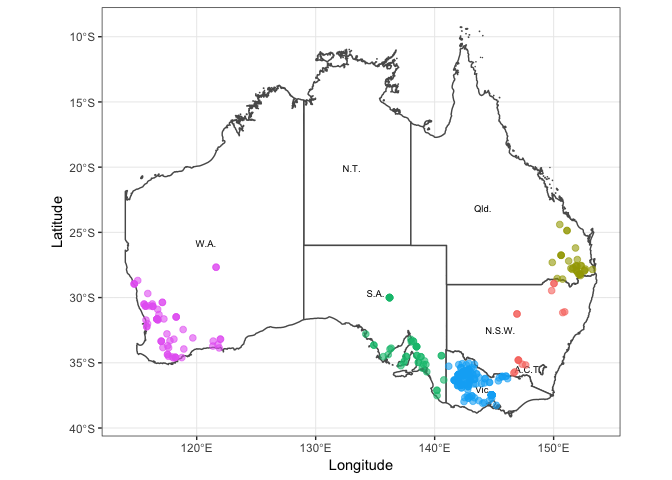

Create a map of Australia and Map Data Collection Points
--------------------------------------------------------

This is a simple RMD file to illustrate how to use
[_rnaturalearth_](https://github.com/ropenscilabs/rnaturalearth), [_simple features_](https://cran.r-project.org/web/packages/sf/vignettes/sf1.html) and
_ggplot2_ to create a map of Australia and plot data collection points on it.


### Setup

To do this you'll need a few packages from CRAN:

``` r
#devtools::install_github("ropenscilabs/rnaturalearthdata")
#devtools::install_github("tidyverse/ggplot2")

library(tidyverse)
```

    ## Loading tidyverse: ggplot2
    ## Loading tidyverse: tibble
    ## Loading tidyverse: tidyr
    ## Loading tidyverse: readr
    ## Loading tidyverse: purrr
    ## Loading tidyverse: dplyr

    ## Conflicts with tidy packages ----------------------------------------------

    ## filter(): dplyr, stats
    ## lag():    dplyr, stats

``` r
library(rnaturalearth)
library(raster)
```

    ## Loading required package: sp

    ## 
    ## Attaching package: 'raster'

    ## The following object is masked from 'package:dplyr':
    ## 
    ##     select

    ## The following object is masked from 'package:tidyr':
    ## 
    ##     extract

``` r
library(sf)
```

    ## Linking to GEOS 3.6.2, GDAL 2.2.1, proj.4 4.9.3, lwgeom 2.3.2 r15302

Get the Data to Create Our Map
------------------------------

### Add a Shapefile of Australia

This is our base layer, Australia, of the map from (Naturalearth.com)\[<https://naturalearth.com/>\]

``` r
oz_shape <- rnaturalearth::ne_states(geounit = "australia",
                                     returnclass = "sf")

plot(oz_shape)
```

    ## Warning: plotting the first 9 out of 59 attributes; use max.plot = 59 to
    ## plot all



However, it includes several islands and ocean that are not of interest to us. To fix this, crop it down to just the mainland plus Tasmania and remove Jervis Bay so that the labels on the final map product are cleaner.

``` r
oz_shape <- st_intersection(oz_shape, 
                st_set_crs(
                  st_as_sf(
                    as(
                      raster::extent(114,
                                     155,
                                     -45,
                                     -9),
                      "SpatialPolygons")),
                  st_crs(oz_shape)))
```

    ## Warning: attribute variables are assumed to be spatially constant
    ## throughout all geometries

``` r
oz_shape <- oz_shape[oz_shape$woe_name != "Jervis Bay", ]

plot(oz_shape)
```

    ## Warning: plotting the first 9 out of 59 attributes; use max.plot = 59 to
    ## plot all



Import Collection Point Data
----------------------------

Assuming the "Geocode\_319 samples.csv" file is in the same working directory as this script.

``` r
point_data <- read_csv("Geocode_319 samples.csv")
```

    ## Parsed with column specification:
    ## cols(
    ##   Location = col_character(),
    ##   State = col_character(),
    ##   Country = col_character(),
    ##   Latitude = col_double(),
    ##   Longitude = col_double()
    ## )

``` r
point_data$State <- as.factor(point_data$State)
```

Plot using `ggplot2`
--------------------

Plot the final combination of data with the Naturalearth data Australia and state outlines with the sampling location points overplayed and colour-coded by the state where they were sampled.

``` r
oz <- ggplot(oz_shape) +
  geom_sf(fill = "white") +
  geom_text(
  data = oz_shape,
  aes(x = longitude,
  y = latitude,
  label = abbrev),
  size = 2.5,
  hjust = 1
  ) +
  geom_point(data = point_data,
  aes(x = Longitude,
  y = Latitude,
  colour = State),
  alpha = 0.6,
  size = 2) +
  theme_bw() +
  xlab("Longitude") +
  ylab("Latitude") +
  theme(legend.position = "none") +
  coord_sf()

oz
```

    ## Warning: Removed 1 rows containing missing values (geom_text).

    ## Warning: Removed 1 rows containing missing values (geom_point).



Save the graph
--------------

Export at 500 dpi for publication with a width 190mm for a 2-column width in an Elsevier publication.

``` r
ggsave("Australia_Map.tiff", width = 190, units = "mm", dpi = 500)
```

Appendix
========

    ## R version 3.4.1 (2017-06-30)
    ## Platform: x86_64-apple-darwin16.7.0 (64-bit)
    ## Running under: macOS Sierra 10.12.6
    ## 
    ## Matrix products: default
    ## BLAS/LAPACK: /usr/local/Cellar/openblas/0.2.20/lib/libopenblasp-r0.2.20.dylib
    ## 
    ## locale:
    ## [1] en_AU.UTF-8/en_AU.UTF-8/en_AU.UTF-8/C/en_AU.UTF-8/en_AU.UTF-8
    ## 
    ## attached base packages:
    ## [1] stats     graphics  grDevices utils     datasets  methods   base     
    ## 
    ## other attached packages:
    ##  [1] sf_0.5-4            raster_2.5-8        sp_1.2-5           
    ##  [4] rnaturalearth_0.1.0 dplyr_0.7.3         purrr_0.2.3        
    ##  [7] readr_1.1.1         tidyr_0.7.1         tibble_1.3.4       
    ## [10] ggplot2_2.2.1.9000  tidyverse_1.1.1    
    ## 
    ## loaded via a namespace (and not attached):
    ##  [1] rnaturalearthhires_0.1.0 reshape2_1.4.2          
    ##  [3] haven_1.1.0              lattice_0.20-35         
    ##  [5] colorspace_1.3-2         htmltools_0.3.6         
    ##  [7] yaml_2.1.14              rlang_0.1.2.9000        
    ##  [9] foreign_0.8-69           glue_1.1.1              
    ## [11] DBI_0.7                  modelr_0.1.1            
    ## [13] readxl_1.0.0             bindrcpp_0.2            
    ## [15] bindr_0.1                plyr_1.8.4              
    ## [17] stringr_1.2.0            rgeos_0.3-23            
    ## [19] munsell_0.4.3            gtable_0.2.0            
    ## [21] cellranger_1.1.0         rvest_0.3.2             
    ## [23] psych_1.7.8              evaluate_0.10.1         
    ## [25] knitr_1.17               forcats_0.2.0           
    ## [27] parallel_3.4.1           broom_0.4.2             
    ## [29] Rcpp_0.12.12             udunits2_0.13           
    ## [31] scales_0.5.0.9000        backports_1.1.0         
    ## [33] jsonlite_1.5             mnormt_1.5-5            
    ## [35] hms_0.3                  digest_0.6.12           
    ## [37] stringi_1.1.5            grid_3.4.1              
    ## [39] rprojroot_1.2            tools_3.4.1             
    ## [41] magrittr_1.5             lazyeval_0.2.0          
    ## [43] pkgconfig_2.0.1          xml2_1.1.1              
    ## [45] lubridate_1.6.0          assertthat_0.2.0        
    ## [47] rmarkdown_1.6            httr_1.3.1              
    ## [49] R6_2.2.2                 units_0.4-6             
    ## [51] nlme_3.1-131             compiler_3.4.1
